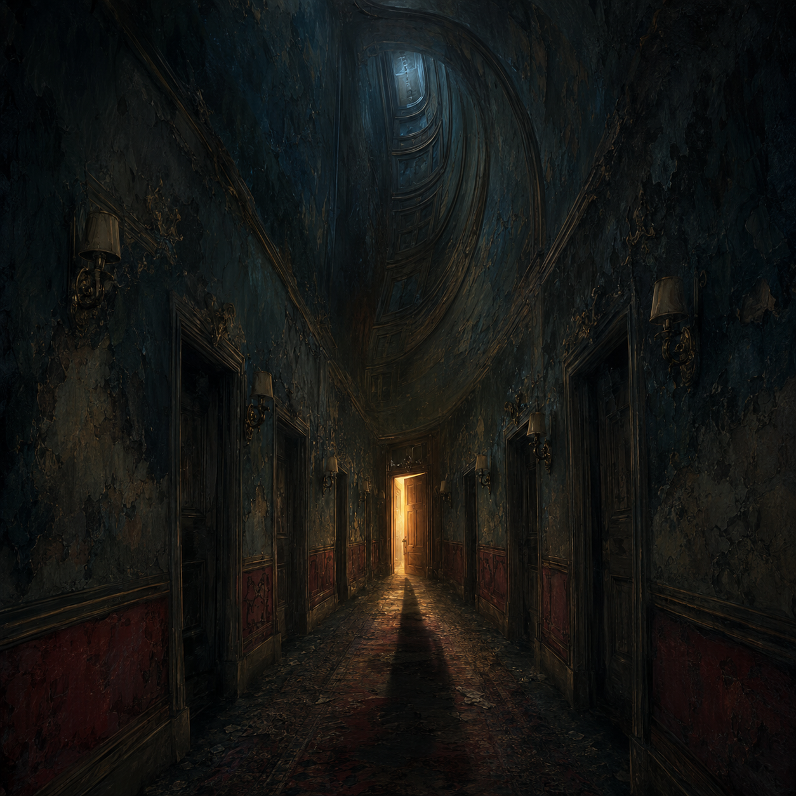

# The Museum of Beautiful Nightmares

**A virtual exhibition of six surreal horror artworks, curated by Stefanie Redding.**

[Enter the exhibition](https://identitynull-404.github.io/museum-of-beautiful-nightmares/) · [Explore the collection](https://identitynull-404.github.io/museum-of-beautiful-nightmares/#gallery)

## The exhibition

*Beautiful Nightmares* finds unease in familiar spaces changed by one impossible detail: a corridor that climbs out of sight, a garden blooming with teeth, a bedroom beneath an inverted sea. The collection draws on dreams, liminal spaces, and psychological horror. Its six pieces are presented as a digital museum, with a curator's statement, individual exhibit labels, and a full-size view for each work.

| Exhibit | Artwork | Setting |
| --- | --- | --- |
| 01 | **The Last Door Awake** | An impossible corridor and an inviting threshold |
| 02 | **Garden of Teeth** | A moonlit garden with ivory, tooth-shaped flowers |
| 03 | **Static in the Nursery** | A forgotten nursery lit by a television's static |
| 04 | **The House That Remembers** | A house folded around rooms from different decades |
| 05 | **The Watcher in the Wallpaper** | An empty parlor whose walls look back |
| 06 | **3:17 A.M.** | A bedroom beneath an upside-down ocean |

## Creative direction and credits

Stefanie Redding developed the original concepts and curated the final image selections, titles, descriptions, exhibition sequence, and museum presentation. All six artworks were created with **ChatGPT using OpenAI GPT Image**, guided by written prompts. The project explores how human direction and curation can give AI generated images a coherent visual and narrative identity.

The artwork files in this repository are the images used in the exhibition. The site credits each piece beside its exhibit label.

## View it

Open the [live exhibition](https://identitynull-404.github.io/museum-of-beautiful-nightmares/) in a browser. Select any artwork to see it at full size; close the view with the close button, the Escape key, or a click outside the image.

To view a local copy, clone this repository and open `index.html` in a browser. The exhibition is a self-contained static page with HTML, CSS, JavaScript, and local PNG assets; it needs no build step or dependencies.

## Project notes

This is both an art exhibition and a small front-end portfolio piece. Its responsive gallery, restrained motion, image viewing dialog, descriptive image text, keyboard interaction, and reduced-motion styling support the curatorial experience across screen sizes. The site keeps the focus on the artwork and the short stories implied by each scene.

© 2026 Stefanie Redding.
